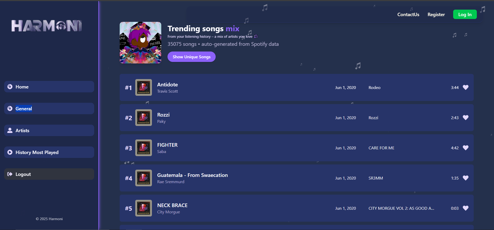

# 🎶 HARMONI – A Modern Spotify Clone




HARMONI is a sleek, responsive, and feature-rich **Spotify-inspired music streaming application** built with **React**, **Vite**, and modern web technologies. Designed for music lovers, HARMONI delivers an immersive experience with trending tracks, artist profiles, personalized browsing, and a fully functional music player — all wrapped in a beautifully crafted UI inspired by Spotify, with its own unique visual flair.

---

## 🌟 Features

- **Trending Music Section** – Discover the latest hits and popular tracks  
- **Artist-Centric Pages** – Explore top artists, their albums, and top 20 songs  
- **Interactive Music Player** – Play, pause, skip, and adjust volume with waveform-like controls  
- **Responsive Design** – Works seamlessly on desktop, tablet, and mobile devices  
- **Dynamic Navigation** – Smooth transitions between Home, Trending, Artists, and Profile  
- **Profile & Settings** – Edit your profile and manage user preferences  
- **Contact & About Us Pages** – Learn about the creators and get in touch  
- **Local Audio Playback** – Integrated MP3 support (e.g., *All of Me* demo track)  
- **Visual Polish** – Animated backgrounds, card-based UI, and a Spotify-like dark theme  

---

## 📁 Project Structure

```text
src/
├── pages/              # Main application views (Home, Profile, Artist pages, etc.)
├── components/         # Reusable UI components (Cards, Navbar, Player, etc.)
├── assets/             # Local data (JSON), logos, and internal media
public/assets/images/   # Public album covers, artist images, and icons
assets/                 # Source media (audio files, development images)
```

**Note:**  
Static assets such as album covers and artist images are optimized and served from `public/` for performance, while the core application logic resides in `src/`.

---

## 🛠️ Technologies Used

| Category     | Technologies |
|--------------|--------------|
| Framework    | React 18 (JSX) |
| Bundler      | Vite |
| Styling      | CSS Modules, Custom CSS, Global Styles |
| State / Data | Local JSON (`spotify_data_history.json`), Component State |
| Media        | HTML5 `<audio>` API |
| Linting      | ESLint (`eslint.config.js`) |
| Deployment   | Vercel, Netlify, or Static Hosting |

---

## 🚀 Getting Started

### Prerequisites

- Node.js **v18+** (recommended)
- npm or yarn

### Installation

1. **Clone the repository**
   ```bash
   git clone <your-repository-url>
   ```

2. **Install dependencies**
   ```bash
   npm install
   # or
   yarn install
   ```

3. **Start the development server**
   ```bash
   npm run dev
   # or
   yarn dev
   ```

4. Open your browser and navigate to:  
   **http://localhost:5173** (or the port assigned by Vite)

---

## 🎨 UI & Design Highlights

- **Dark Theme** with vibrant accent colors for an authentic music app experience  
- **Animated Backgrounds** using `ParticleBackground.jsx` for added visual depth  
- **Card-Based Layouts** for albums, songs, and artists with hover effects  
- **Custom Music Player** with play/pause, next/previous, and progress controls  
- **QR Code Integration** – Scan to share or access mobile-friendly features  

---

## 📌 Future Enhancements (Optional)

- User authentication & playlists  
- API-based music streaming  
- Lyrics integration  
- Offline caching & PWA support  

---

## 📄 License

This project is for educational and demonstration purposes.  
Feel free to fork, customize, and enhance it.
